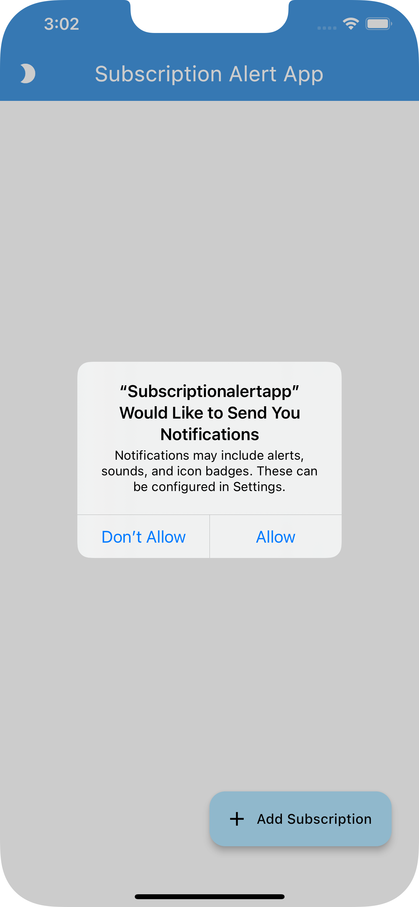
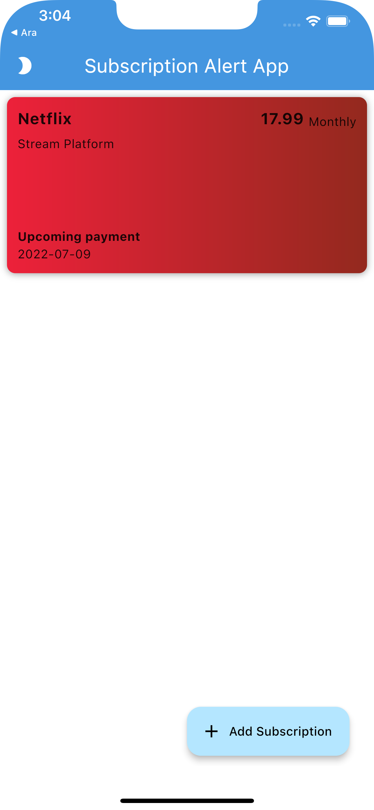
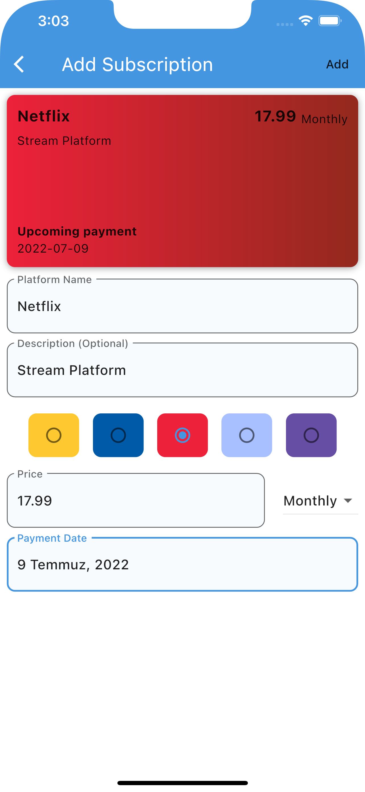
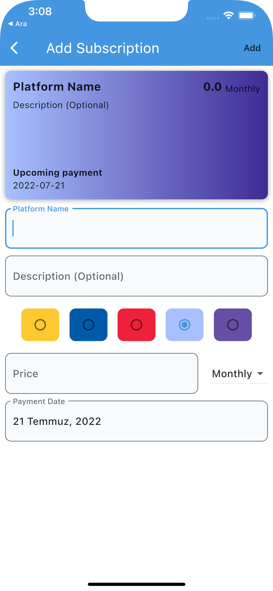

# Subscription Alert App

- Animations
  - OpenContainer animation
- Local Database
  - Creating a HiveModel with Hive
- Local Notifications
  - Listening to notifications with RXDart
  - Redirect to custom route for clicked notification
- Timezone with DateTime
  - Returns the appropriate date and time in whichever time zone it is.

## Screenshots

### Notification Alert

&nbsp;
&nbsp;

### Home Screen

### Notification Examples

&nbsp;
&nbsp;
&nbsp;
&nbsp;

### Add Subscription Screen

### App Gif

